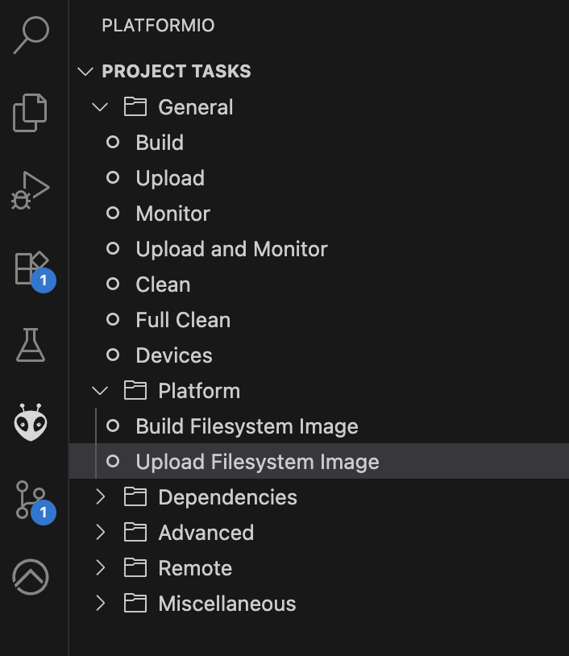

# Gerätetypen

Diese Einsellung legt fest, welche Gerätetype verwendet wird.

<!-- DOCEND -->
Zur Auswahl stehen:

- Ein- Ausschaltbares Gerät 
- Steckdose
- Lampe
- Jalousie
- Rolladen
- Markise
- Thermostat
- Anzeige
- Alam
- Lüfter
- Fenster
- Tür
- Garagentor
- Szene
- Mediensteuerung

Mehr Informationen über die Geräte die angesteuert werden können, sind unter [Applikationsbeschreibung-Geräte](Applikationsbeschreibung-Geräte) zu finden.

## spezifische Geräteeinstellungen für Displays

<!-- DOC  HelpContext="BildEinAus" -->
### Benutzerdefiniertes Bild (Ein/Aus)

In diesem Abschnitt können benutzerspezifische Bilder für die Anzeige definiert werden.
Dabei kann für den Zustand Aus bzw. Ein jeweils ein anderes Bild konfiguriert werden.

<!-- DOC  HelpContext="BildProzent" -->
### Benutzerdefiniertes Bild (Prozent)

In diesem Abschnitt können benutzerspezifische Bilder für die Anzeige definiert werden.
Dabei können abhängig 3 Bilder die abhängig vom Prozentwert sind, konfiguriert werden.

<!-- DOC  HelpContext="BildWert" -->
### Benutzerdefiniertes Bild (Wert)

In diesem Abschnitt können benutzerspezifische Bilder für die Anzeige definiert werden.
Dabei können abhängig 3 Bilder die abhängig vom Wert sind, konfiguriert werden.

<!-- DOC  HelpContext="BildModus" -->
### Benutzerdefiniertes Bild (Modus)

In diesem Abschnitt können benutzerspezifische Bilder für die Anzeige definiert werden.
Dabei können abhängig 3 Bilder die abhängig vom Modus und Zustand sind, konfiguriert werden.

<!-- DOC -->
#### Wert

Messwertgrenze für die Auswahl des Bildes.

<!-- DOC -->
#### Anzeigemodus und Statuseinfaerbung

- Nein
  Das Bild wird in Originalfarbe angezeigt

- Ja
  Das Bild wird abhängig vom Gerätestatus eigefärbt. 
  Bei Auswahl dieser Option, empfiehlt sich die PNG Datei monochrom mit Alpah Kanal hinterlegen.

<!-- DOC -->
#### Bilddatei  

Bilddateien im PNG Format müssen zuerst in das Gerät übertragen werden.
Dies kann am Einfachsten über den USB Bildupdload erfolgen.

- das Gerät mit dem USB-Port des Computers verbinden
- Doppelklick auf die PROG Taste
- -> Nun sollte ein Laufwerk sichtbar werden und die PROG Led leuchten
- In das Verzeichnis "Inbox" die Bilddatein kopieren
- Das Laufwerk auswerfen
- -> Die PROG LED beginnt zu flackern als Signal, dass die Datein übertragen werden

Wenn ein Terminal mit dem Gerät verbunden ist, kann man über das Kommando "fs" den Inhalt des Dateisystems prüfen.
Hinweis: Das Laden der Bilddatei ignoriert die Groß- Kleinschreibung.

Alternativer Upload über VS-Code:
- Das Projekt https://github.com/OpenKNX/OAM-TouchRound.git ausgechecken
- In Visual Studio Code mit installierter Extension "PlatformIO" den Ordner öffnen
- Die Konfiguration "env:release_RP2350" in der Fußzeile auswählen.
- In den Order "data" die gewünschten Datein kopieren.
- Das Plugin PlatformIO auf der linken Seiten auswählen
- Datein über "Upload File System" hochladen

Eine sehr gute Auswahl an monochromen Bildern die für Statuseinfärbungen verwendet werden können sind die Material Design Icons
[https://pictogrammers.com/library/mdi/](https://pictogrammers.com/library/mdi/).
Beim Export den Advanced Export verwendet und die in der ETS bei der Bilddatei angegebene Pixelanzahl verwenden.
<!-- DOCEND -->

### Alarm Geräte-Einstellungen

<!-- DOC -->
### Roter Hintergrund

Über diese Einstellung kann bei Alarm Geräten der Bildschirmhintergrund rot eingefärbt werden.

<!-- DOC HelpContext="StatusInactive" -->
### Statusanzeige Inaktiv

Text der bei einem Alarm Gerät angezeigt wird, wenn der Alarm inaktiv ist.

<!-- DOC HelpContext="StatusActive" -->
### Statusanzeige Aktiv

Text der bei einem Alarm Gerät angezeigt wird, wenn der Alarm aktiv ist.